<div align="center">
    
# 🧠🔐 Smart and Secure User Management System 🛡️🚀  
</div>
<div align="center">

  
  
  
  
  
  

</div>


### 📌  Landing page
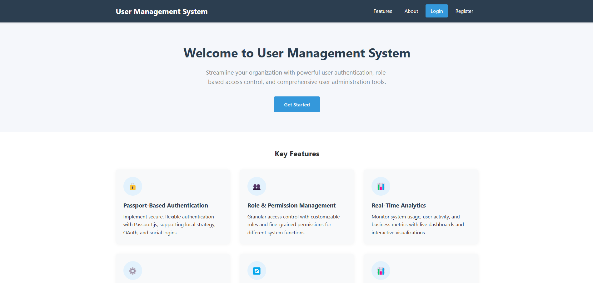


## 📝 Description

🔐 A powerful and secure User Management System built with Laravel, designed to streamline the management of users, suppliers, and customers. It features robust role-based access control (RBAC), allowing administrators to assign and manage permissions with precision. 📋

📦 The system supports supplier and customer modules with full CRUD functionality, enabling seamless data management and real-time collaboration. 

📊 Comprehensive dashboards and interactive data visualizations provide valuable insights into user activity, system usage, and business performance, helping administrators make data-driven decisions efficiently.

✨ With built-in support for authentication, authorization, reporting, and modular architecture, this application is ideal for enterprise-grade solutions where security, scalability, and usability are top priorities.

🎓 This system was developed as part of a university /Internship project to demonstrate a complete Laravel application with role-based permissions, database relationships, and interactive dashboards.

### 💼 What it does  
The User Management System (UMS) is an enterprise-grade application that provides a complete framework for managing users, suppliers, and customers. It features role-based access control, comprehensive dashboards, data visualization, and reporting capabilities.

### 🛠️ Problem it solves  
Traditional user management systems often lack flexibility, comprehensive reporting, and intuitive interfaces. UMS addresses these challenges by offering:  
- 🧩 Granular permission control for different user roles  
- 📊 Comprehensive analytics dashboards for data-driven decisions  
- 🔗 Integrated supplier and customer management  
- 🛡️ Detailed activity logging for compliance and security  

### 👥 Who it's for  
- **🏢 Business Administrators** needing to manage users across an organization  
- **🖥️ IT Managers** responsible for user access and permissions  
- **📦 Supply Chain Managers** tracking supplier information and performance  
- **🤝 Customer Relationship Teams** maintaining customer data and activities  


## 🚀 Features

### 🔐 Authentication & Authorization
- 🔑 Login system with OTP verification
- 👮‍♀️ Role-based access control using Spatie Permissions
- 📝 User registration with form validation
- 🔒 Session management and security

### 👤 User Management
- ✏️ Create, read, update, and delete users
- 👨‍💼 User profile management
- 🎭 Role and permission assignment
- 📊 Export users data in CSV, Excel, and PDF formats
- 🔍 Advanced user filtering and searching

### 🏭 Supplier Management
- 📋 Complete CRUD operations for suppliers
- 📦 Supplier information tracking
- 📜 Contract management
- 📈 Basic supplier analytics
- 🌟 Supplier performance metrics

### 🧑‍🤝‍🧑 Customer Management
- 💼 Customer database management
- 📂 Customer information tracking
- 📊 Customer analytics
- 🗺️ Location-based customer distribution

### 📊 Dashboards
- 👑 Admin dashboard with system metrics
- 🏭 Supplier dashboard with relevant KPIs
- 🧑‍🤝‍🧑 Customer dashboard with activity tracking
- 📈 Data visualization charts
- 🔍 Interactive data filtering

### 📝 Activity Logging
- 👀 User action tracking
- 📜 Activity history
- 🔍 Audit trails for compliance
- 🔐 Security monitoring

## 📸 Screenshots

### 📌  Login
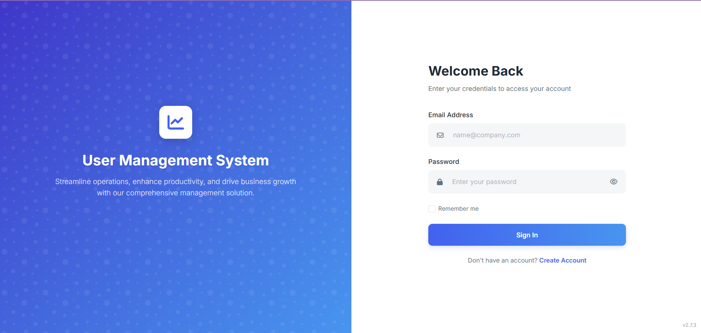

### 📌  Register
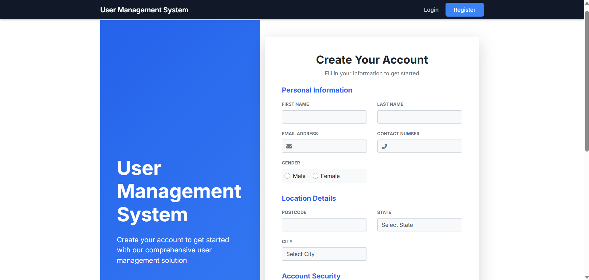

### 📌  2FA (OTP Verification)
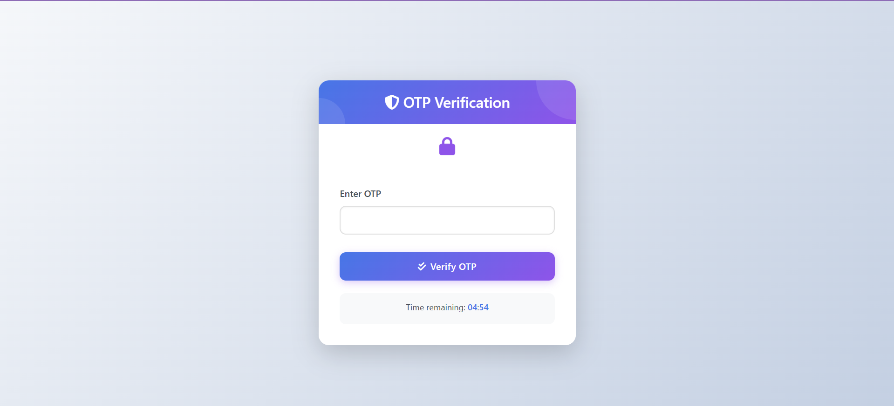

### 📌  2FA (OTP Verification Mail)
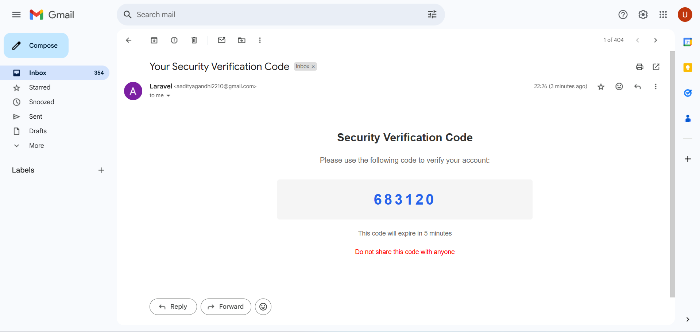

### 📌 Admin Dashboard
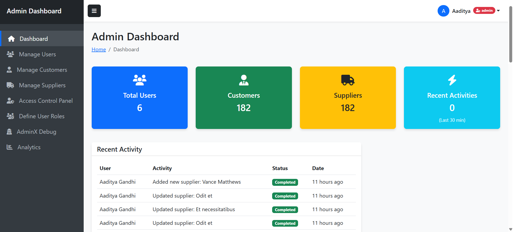
  
### 📌  User Management
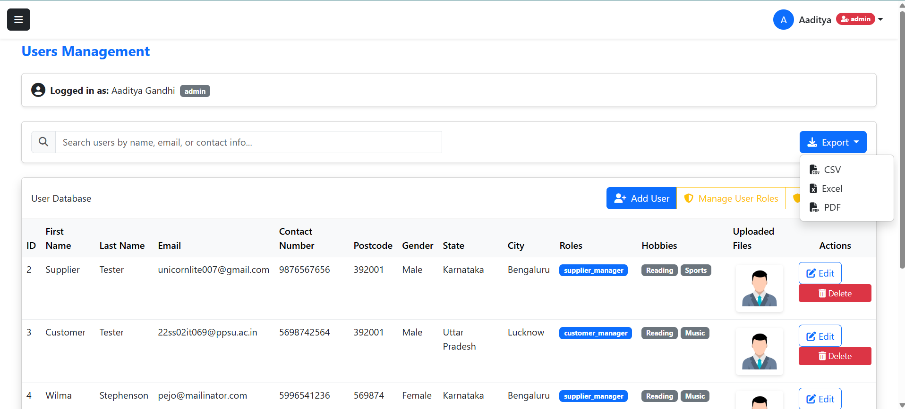

### 📌  Analytics
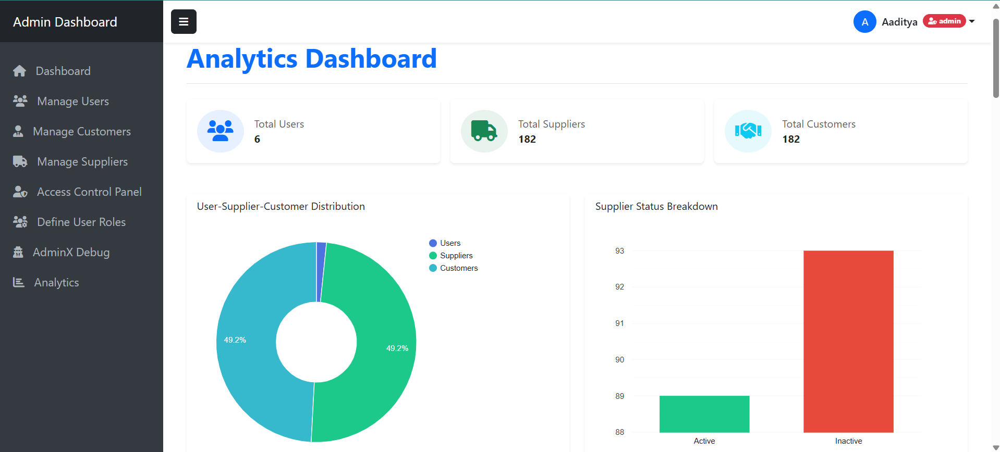

### 📌  Supplier Dashboard
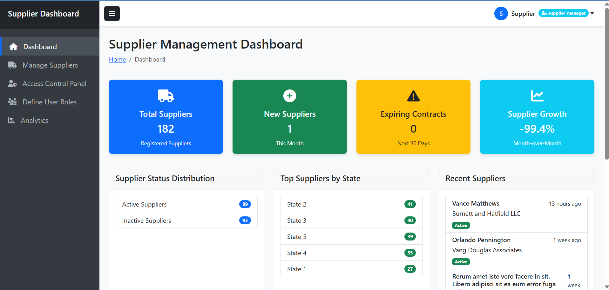

### 📌  Supplier Management
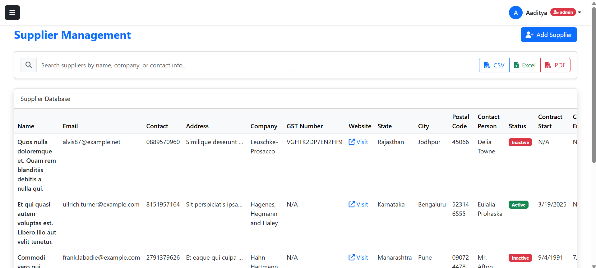

### 📌  Customer Dashboard
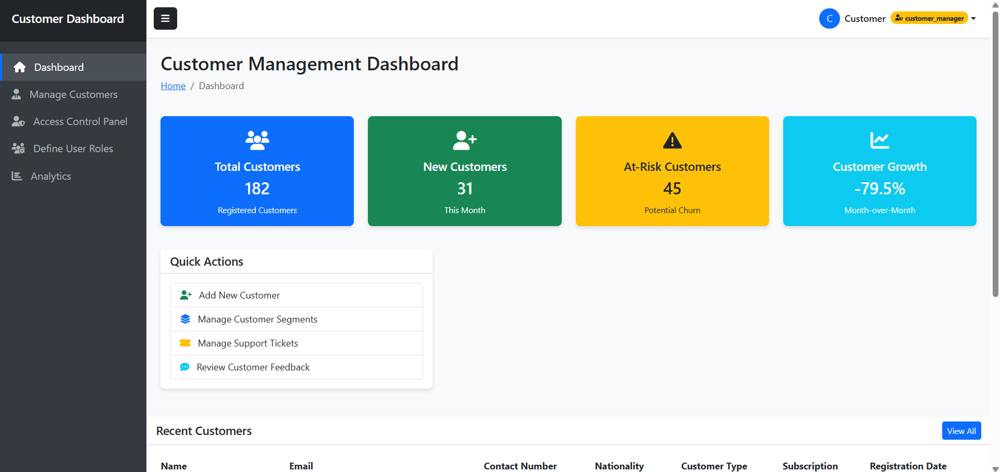

### 📌  Customer Management
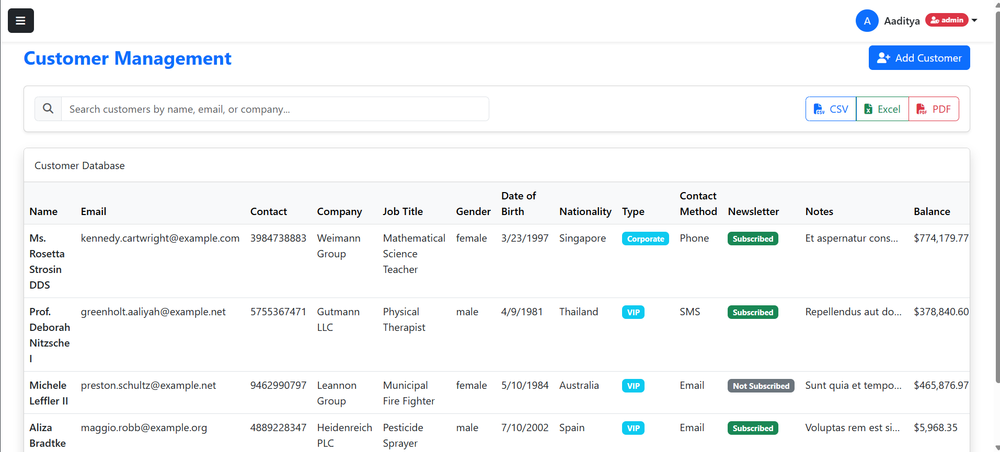

### 📌  Analytics


### 📌  Laravel Telescope
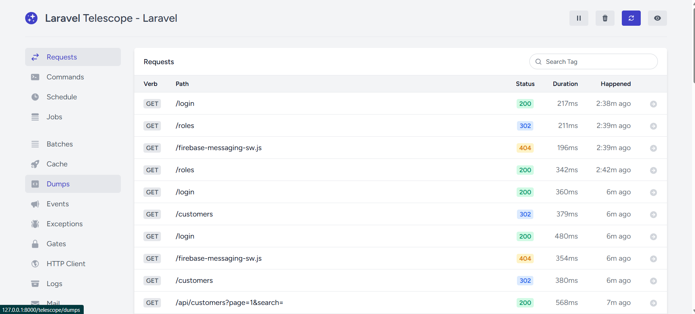

### 📌  Access Control Panel
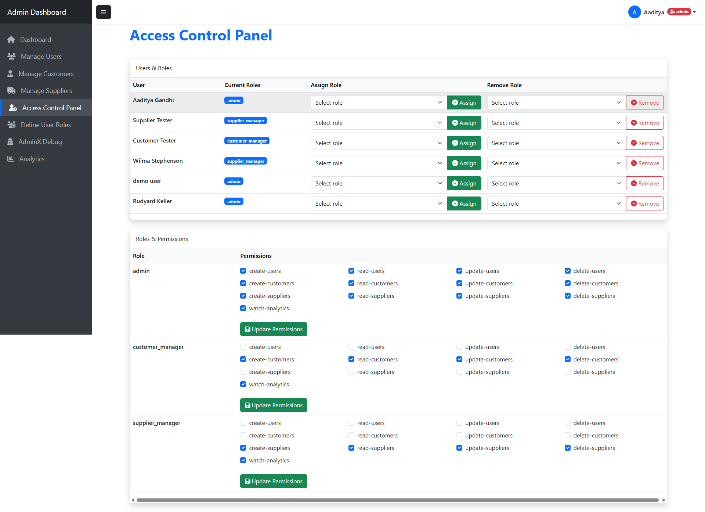

### 📌  Define New Roles
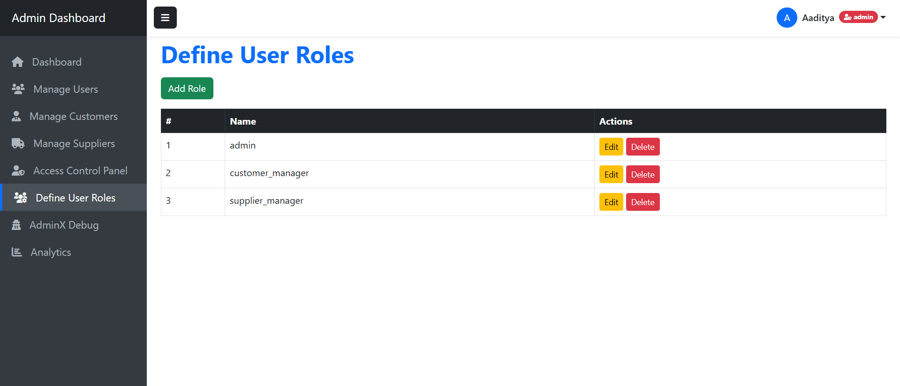

### 📌  Profile
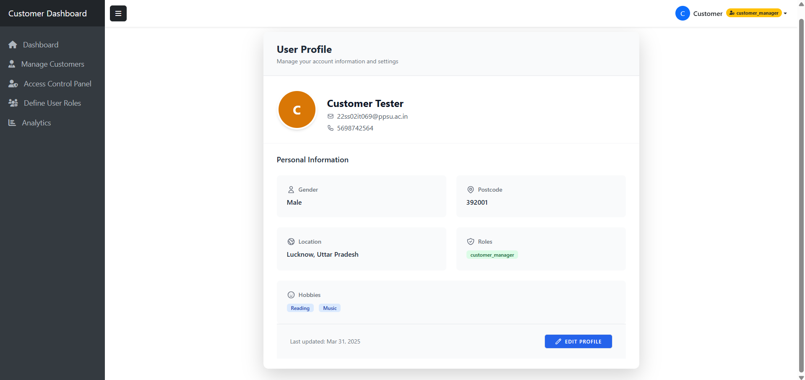

### 🧭 Basic Navigation

1. **📊 Dashboard**: The main landing page after login shows key metrics and recent activities  
2. **👤 User Management**: Access from the sidebar to create, view, edit, and delete users  
3. **🏭 Supplier Management**: Add new suppliers, view supplier details, and track performance  
4. **🧑‍💼 Customer Management**: Manage customer information and view analytics  
5. **📄 Reports**: Generate and export reports in various formats  
6. **⚙️ Settings**: Configure system settings and manage roles/permissions  


## 📊 Project Structure

### 📁 Folder Structure
```
user-management-system/
├── app/                          # Application code
│   ├── Http/
│   │   ├── Controllers/          # All controllers
│   │   ├── Middleware/           # Request middleware
│   │   └── Requests/             # Form requests
│   ├── Models/                   # Eloquent models
│   └── Exports/                  # Export classes
├── config/                       # Configuration files
├── database/
│   ├── migrations/               # Database migrations
│   └── seeders/                  # Database seeders
├── public/                       # Publicly accessible files
├── resources/
│   ├── js/                       # JavaScript files
│   ├── css/                      # CSS files
│   └── views/                    # Blade templates
├── routes/                       # Route definitions
│   ├── web.php                   # Web routes
│   └── api.php                   # API routes
└── storage/                      # Application storage
```

### 🧩 Key Components

#### 📂 **Controllers** (Located in `app/Http/Controllers`)
- `🔐 AuthController`: Handles login, registration, and authentication  
- `📊 DashboardController`: Main dashboard analytics  
- `👤 UserController`: User management  
- `🏭 SupplierController`: Supplier CRUD operations  
- `🧑‍🤝‍🧑 CustomerController`: Customer CRUD operations  
- `📈 ChartController`: Data visualization endpoints  
- `🎭 RoleController`: Role management  
- `👮‍♀️ UserRoleController`: User-role assignments  
- `📤 UserExportController`: Export functionality  

---

#### 🧬 **Models** (Located in `app/Models`)
- `👤 User`: User model with role relationships  
- `🏭 Supplier`: Supplier data model  
- `🧑‍🤝‍🧑 Customer`: Customer data model  
- `📝 Activity`: Activity logging model  
- `🌍 State` & `🏙️ City`: Location models  

---

#### 👁️ **Views** (Located in `resources/views`)
- 🧱 Main layouts and reusable components  
- 📊 Dashboard views  
- 📝 User, supplier, and customer management forms  
- 📈 Reports and charts  
- 🔐 Authentication templates  

---

#### 🔀 **Routes** (Located in `routes/`)
- `🕸️ web.php`: Web interface routes  
- `🌐 api.php`: API endpoints  
- `🛠️ console.php`: Custom Artisan commands  

---

#### 🧰 **Middleware** (Located in `app/Http/Middleware`)
- 🛡️ Role and permission verification  
- 🔒 Authentication checks  
- ✅ Request validations  

---

#### 🗃️ **Database** (Located in `database/`)
- 🏗️ Migrations for all tables  
- 🌱 Seeders for initial data  
- 🧪 Factories for testing  


## 👥 Role-Based Access

The system implements the following roles:

- **👑 Admin**: Full system access
- **👨‍💼 Customer Manager**: Manages customers
- **🏭 Supplier Manager**: Manages suppliers
- **👤 Regular User**: Basic read access

### 🔑 Permission Groups

- **👤 User Management**: create-users, read-users, update-users, delete-users
- **🏭 Supplier Management**: create-suppliers, read-suppliers, update-suppliers, delete-suppliers
- **🧑‍🤝‍🧑 Customer Management**: create-customers, read-customers, update-customers, delete-customers

### 📋 Role-Permission Matrix

| Permission | 👑 Admin | 👨‍💼 Customer Manager | 🏭 Supplier Manager | 👤 Regular User |
|------------|-------|------------------|------------------|--------------|
| create-users | ✅ | ❌ | ❌ | ❌ |
| read-users | ✅ | ✅ | ✅ | ✅ |
| update-users | ✅ | ❌ | ❌ | ❌ |
| delete-users | ✅ | ❌ | ❌ | ❌ |
| create-suppliers | ✅ | ❌ | ✅ | ❌ |
| read-suppliers | ✅ | ❌ | ✅ | ✅ |
| update-suppliers | ✅ | ❌ | ✅ | ❌ |
| delete-suppliers | ✅ | ❌ | ✅ | ❌ |
| create-customers | ✅ | ✅ | ❌ | ❌ |
| read-customers | ✅ | ✅ | ❌ | ✅ |
| update-customers | ✅ | ✅ | ❌ | ❌ |
| delete-customers | ✅ | ✅ | ❌ | ❌ |


## 📱 API Routes

The system provides API endpoints for integration with other applications:

### 🔐 Authentication
- `POST /api/login` - Get access token
- `POST /api/register` - Register new user
- `POST /api/logout` - Invalidate token

### 👤 Users
- `GET /api/users` - List all users
- `POST /api/users` - Create new user
- `GET /api/users/{id}` - Get user details
- `PUT /api/users/{id}` - Update user
- `DELETE /api/users/{id}` - Delete user

### 🏭 Suppliers
- `GET /api/suppliers` - List all suppliers
- `POST /api/suppliers` - Create new supplier
- `GET /api/suppliers/{id}` - Get supplier details
- `PUT /api/suppliers/{id}` - Update supplier
- `DELETE /api/suppliers/{id}` - Delete supplier

### 🧑‍🤝‍🧑 Customers
- `GET /api/customers` - List all customers
- `POST /api/customers` - Create new customer
- `GET /api/customers/{id}` - Get customer details
- `PUT /api/customers/{id}` - Update customer
- `DELETE /api/customers/{id}` - Delete customer

## 📱 API Support

The system includes Laravel Passport for API authentication, enabling:

- **Mobile Application Integration**: 
  - Secure OAuth2 authentication
  - Token-based API access
  - Mobile-specific endpoints

- **Third-party Service Integration**: 
  - Webhook support
  - OAuth2 client credentials flow
  - API rate limiting and security

- **API Token Management**:
  - Personal access tokens
  - Client credentials
  - Authorization code grant
  - Token scoping and expiration

## 🌐 Technologies Used

- **⚙️ Backend**: 
  - 🔧 Laravel 11 framework
  - 🐘 PHP 8.2+
  - 🗄️ MySQL/MariaDB

- **🔐 Authentication**: 
  - 🔑 Laravel Passport
  - 🔢 OTP verification

- **👮‍♀️ Authorization**: 
  - 🔒 Spatie Laravel Permission

- **🎨 Frontend**: 
  - 📄 Blade templating
  - 🎭 TailwindCSS
  - 🔄 Basic JavaScript
  - 📊 Chart.js for visualizations

- **📊 Export & Reporting**:
  - 📑 DOMPDF (PDF generation)
  - 📊 Laravel Excel
  - 📋 CSV export

- **📊 Charts & Visualization**:  
  - 📈 JavaScript charting libraries (Chart.js)  
  - 📋 Interactive data tables  
  - 🗺️ SVG maps for geographical data  

- **🛠️ Development Tools**:  
  - 🔍 Laravel Telescope for debugging  
  - 📦 Composer for dependency management  
  - 🧹 Laravel Pint for code styling  

- **🔮 Future Considerations**:  
  - 🔗 Blockchain integration for secure transactions  
  - 🔌 Expanded third-party integrations  
  - 🧠 Machine learning for customer insights  
  - 🗣️ Voice interface capabilities  


## 📋 Prerequisites

- 🐘 PHP >= 8.2
- 🎼 Composer
- 🗄️ MySQL or compatible database
- 🟢 Node.js and NPM
- 🔄 Git (optional, for cloning the repository)

## 🛠️ Installation

1. **📥 Clone the repository**

```bash
git clone https://github.com/aaditya2210/user-management-system.git
cd user-management-system
```

2. **🔽 Install PHP dependencies**

```bash
composer install
```

3. **📦 Install JS dependencies**

```bash
npm install
```

4. **⚙️ Set up environment file**

```bash
cp .env.example .env
php artisan key:generate
```

5. **🗄️ Configure database in .env file**

```
DB_CONNECTION=mysql
DB_HOST=127.0.0.1
DB_PORT=3306
DB_DATABASE=ums_db
DB_USERNAME=root
DB_PASSWORD=
```

6. **🚀 Run migrations and seed the database**

```bash
php artisan migrate --seed
```

7. **🔑 Generate Passport encryption keys**

```bash
php artisan passport:install
```

8. **🏗️ Build frontend assets**

```bash
npm run dev
```

9. **🚀 Start the development server**

```bash
php artisan serve
```

## 📄 License

This project is licensed under the MIT License - see the [LICENSE](LICENSE) file for details.

## 🤝 Contributing


- Contributions are welcome! Please feel free to submit a Pull Request.

1. 🍴 **Fork** the repository  
2. 🌿 **Create** your feature branch (`git checkout -b feature/AmazingFeature`)  
3. 💾 **Commit** your changes (`git commit -m 'Add some AmazingFeature'`)  
4. 🚀 **Push** to the branch (`git push origin feature/AmazingFeature`)  
5. 📬 **Open** a Pull Request  

### 🔄 Development Workflow

1. 📋 Check the [Issues](https://github.com/aaditya2210/User-Management-System-Final-Sem-Project/issues) page for open tasks  
2. 💬 Comment on an issue you'd like to work on  
3. 🧪 Follow coding standards and write tests  
4. ✅ Submit a PR with a detailed description of changes  

---

## 👨‍💻 Author

**Aaditya Gandhi**  
- 📧 Email: aadityagandhi2210@gmail.com  
- 🐙 GitHub: [aaditya2210](https://github.com/aaditya2210)  
- 💼 LinkedIn: [Aaditya Gandhi](https://www.linkedin.com/in/aaditya-gandhi)

---

## 🙏 Acknowledgments


- 🧱 [Laravel Team](https://laravel.com/) for the amazing framework  
- 🧩 [Spatie](https://spatie.be/) for the Laravel Permission package  
- 🎨 [TailwindCSS](https://tailwindcss.com/) for the utility-first CSS framework  
- 📊 [Chart.js](https://www.chartjs.org/) for beautiful chart components  
- 🌍 All open-source contributors whose packages made this project possible
  


